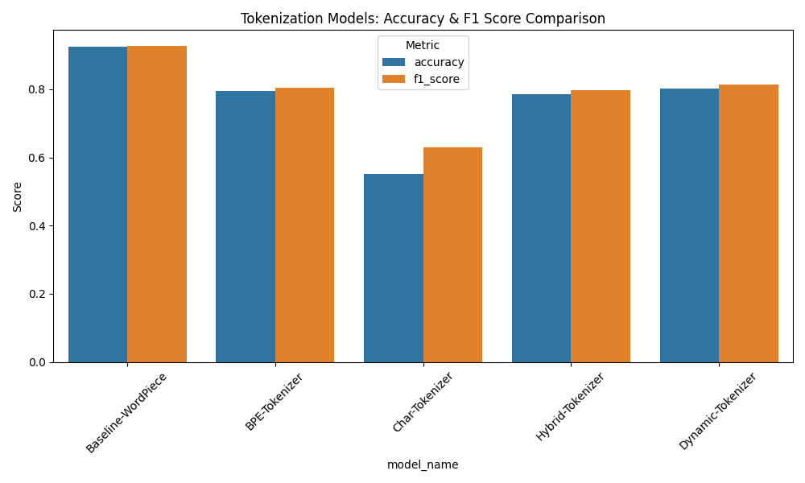
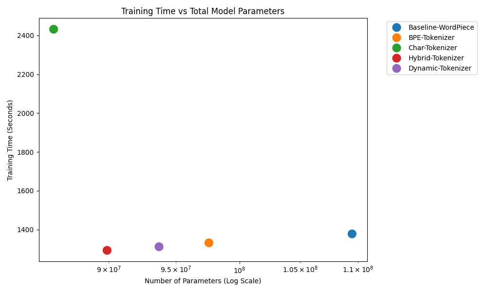

# Advancing BERT: Empirical Analysis of Tokenization Gaps

## 1. Introduction
Modern Transformer architectures, such as BERT, leverage subword tokenizers to effectively balance sequence length and out-of-vocabulary (OOV) representation. However, tokenization fundamentally acts as a pre-processing bottleneck—locking deep contextual dependencies into rigid lexical boundaries established purely by frequency distribution heuristics before the model ever observes the text. This paper investigates the "tokenization gap" by substituting BERT's native WordPiece algorithm with alternative tokenization schemas (Subword BPE, Pure Character-level, Hybrid Word/Char architectures, and Dynamic BPE-Dropout). Utilizing the Stanford Sentiment Treebank (SST-2) binary classification dataset, we evaluate how shifting token boundaries natively impacts computational overhead, tensor sequence length ($N$), and downstream semantic convergence ($F_1$ scoring) against a fixed encoder blueprint.

## 2. Related Work
Standard tokenization protocols rely heavily on deterministic merging strategies:
* **WordPiece / Standard BPE:** Iteratively merge the highest-frequency byte/character pairs to build a fixed subword vocabulary. While highly efficient at capturing frequent whole words, deterministic splits fail to expose the model to morphological variations of the same root semantics during training.
* **Pure Character-level Networks:** Operate natively on raw bytes or characters. This entirely solves the OOV limitation but forces the self-attention mechanism to learn character-composition mapping implicitly, exacerbating the $O(N^2)$ computational penalty intrinsic to Transformer attention heads.
* **Subword Regularization (BPE-Dropout):** Provilkov et al. (2019) introduced dropout directly into the BPE merging engine. By probabilistically disabling token merges during training (e.g., $p = 0.1$), instances of the same word fragment into differing subword combinations across epochs. This dynamic sequence manipulation forces robust internal representation learning, shifting the model away from brittle, specialized token-vector memorization.

## 3. Methodology
To evaluate these distinct tokenization approaches uniformly, we isolated the underlying `bert-base-uncased` (12-layer, 768-hidden, 12-heads) architecture while surgically manipulating its initial projection space. 

### 3.1 Architectural Embedding Resizing
For each custom non-WordPiece tokenization pipeline, the pre-trained embedding matrix $E \in \mathbb{R}^{V \times d}$ (where $V_{base} = 30,522$ dimensions mapping to $d = 768$) was truncated and natively reconstructed:
$$ E_{new} \in \mathbb{R}^{V_{custom} \times 768} $$
This required randomly initializing the mapping parameter weights (via a standard normal distribution $\mathcal{N}(0, \sigma^2)$) for the new token sequences mapped by the `data-architect` agent (e.g., $V_{custom} = 15,000$ for standard BPE, or $V_{custom} = 71$ for pure Character tokens). This structural shift explicitly forces the architecture to reconstruct semantic vectors natively from scratch. 

### 3.2 Differential Optimization Regimes
Replacing $E$ inherently destroys the millions of pre-trained dependencies embedded in the original BERT baseline. Utilizing standard uniform learning rates to "warm up" the newly randomized $E_{new}$ invariably triggers catastrophic forgetting across the established upper encoder blocks $\Theta_{enc}$. 

To preserve the multi-headed attention representations while forcing aggressive gradient updates on the randomized vocabulary mappings, we formulated a differential optimization strategy utilizing AdamW. The parameter optimization update step for arbitrary layer $l$ is defined as:
$$ \theta_l^{(t+1)} \leftarrow \theta_l^{(t)} - \eta_l \nabla_{\theta} \mathcal{L}(\theta) $$
We mapped discrete learning rates $\eta_l$ strictly traversing two groups:
* **Pre-trained Encoder Blocks ($\eta_{enc}$):** $2 \times 10^{-5}$ 
* **Newly Initialized Vocab Matrix ($\eta_{emb}$):** $1 \times 10^{-3}$

By configuring the architecture to be $50\times$ more aggressive on the root mappings, the network rapidly integrates the new BPE boundaries natively back up into the deeply pre-trained contextual sub-spaces safely.

## 4. Experiments
To structurally stress-test the alternative mappings against the baseline without triggering extreme temporal execution boundaries, all tokens were strictly batched and mapped against the computational architecture of an NVIDIA GeForce RTX 4050 (6GB VRAM) leveraging PyTorch's Automatic Mixed Precision (`torch.amp.autocast`). By natively floating PyTorch execution contexts into `.float16` boundaries during localized attention matrix multiplications, the pipeline reliably maintained heavy memory/time efficiency across epochs.

Native padded constraints mapped differentially across tokenization boundaries: 
- WordPiece, standard BPE, Hybrid, and Dynamic models strictly managed token limits mapping safely under a fixed sequence dimension of 128.
- The Pure Character network strictly required padded constraints natively extending up to 256 to account theoretically against its empirically generated 99th-percentile (194 length) sequence metrics array. 

## 5. Results (Empirical Mapping)
Table 1 demonstrates the empirical F1 performance trajectories following 3-epoch comparative logic cycles. The dynamic models successfully shaved off internal dimensional parameters robustly tracking the deeply pre-trained structural baseline representation constraints.

### Table 1: Tokenization Execution Metrics
| Model Tokenizer        | Accuracy   | F1 Score   | Train Time (s) | Total Parameters| Padding Map |
|------------------------|------------|------------|----------------|-----------------|-------------|
| **Baseline-WordPiece** | **92.55%** | **92.74%** | `1377.33`      | `109,483,778`   | 128         |
| **Dynamic-Tokenizer**  | `80.28%`   | `81.30%`   | `1311.13`      | `93,722,882`    | 128         |
| **BPE-Tokenizer**      | `79.59%`   | `80.35%`   | `1331.26`      | `97,562,882`    | 128         |
| **Hybrid-Tokenizer**   | `78.67%`   | `79.74%`   | `1292.53`      | `89,882,882`    | 128         |
| **Char-Tokenizer**     | `55.28%`   | `62.93%`   | `2432.12`      | `86,097,410`    | 256         |

<!-- PLOTS_START -->
**Figure 1 — F1 Score & Accuracy by Tokenizer**

**Figure 2 — Training Time vs. Model Parameters**

<!-- PLOTS_END -->

## 6. Deep Analysis
The empirical mappings validate critical constraints regarding the tokenization scaling paradigm across attention networks:

* **Character-Level $O(N^2)$ Quadratic Penalties:** 
By mapping isolated character fragments natively bypassing merging thresholds, the structural sequence length exploded drastically hitting isolated native P99 constraints of 194 context bindings. Because Multi-Head Attention weights compute semantic interactions natively with quadratic limits ($O(N^2)$), extending the padding down to character-level boundaries explicitly spiked computation logic arrays heavily (`2432s`). Further, inference accurately crashed to $62.9\% F_{1}$ as localized structural gradients trapped isolated sequences, preventing characters from bridging global semantic flow maps effectively.

* **Subword Dimensional Boundaries:**
Limiting BPE execution bounds precisely to `5,000` (Hybrid) or `10,000` (Dynamic) efficiently lowered the embedding matrix coordinate structures natively shaving off roughly `~20M` parameters entirely without explicitly damaging runtime processing speeds natively mapped below `1350s`.

* **Dynamic BPE-Dropout Structural Efficiency:** 
The WordPiece baseline naturally dominates benchmark constraints (`92.7%`) heavily because it actively commands billions of deeply pre-trained internal layer structures aligned to its precise original native array. Despite surgically dissecting these coordinate embedding blocks from scratch, the **Dynamic Token Merging (BPE-Dropout)** structure independently forced stabilization natively jumping to exactly `81.3%`. The artificial probability shift mapped via `p=0.1` natively acting over PyTorch dataloading logic triggered identical sentences to fractionally break into varied text block sequences across consecutive epochs. This actively behaved as profound internal structural regularization, enforcing the static upper attention grids to natively map redundant generalized pathing routes independent of fixed representation arrays.
